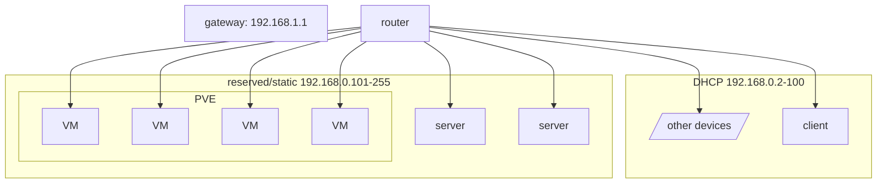

# Deployment layout

```mermaid
graph TD
    gateway[gateway: 192.168.1.1]
    A[router] --> VM1[VM]
    A[router] --> VM2[VM]
    A[router] --> VM3[VM]
    A[router] --> VM...[VM]
    A[router] --> Server1[server]
    A[router] --> Server2[server]
    A[router] --> other[/other devices/]
    A[router] --> client[client]
    subgraph DHCP 192.168.0.2-100
      other
      client
    end
    subgraph PVE
        VM1
        VM2
        VM3
        VM...
    end
    subgraph reserved/static 192.168.0.101-255
      Server1
      Server2
      PVE
    end
```
