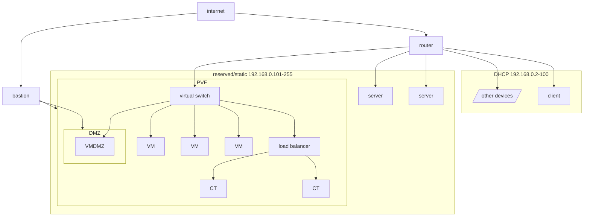

# Deployment layout

```mermaid
graph TD
    internet --> bastion
    internet --> A
    bastion --> PVE
    bastion --> DMZ

    A[router//gateway: 192.168.1.1] --> 
    vswitch[virtual switch] --> LB[load balancer]
    
    vswitch --> VM1[VM]
    vswitch--> VM2[VM]

    vswitch --> VM3[VM]
    LB --> CT1[CT]
    LB --> CT2[CT]
    
    A[router] --> Server1[server]
    A[router] --> Server2[server]
    A[router] --> other[/other devices/]
    A[router] --> client[client]
    subgraph DHCP 192.168.0.2-100
      other
      client
    end
    subgraph PVE
        vswitch
        VM1
        VM2
        VM3
        VMDMZ
        LB
        CT1
        CT2
        vswitch --> VMDMZ
        subgraph DMZ

       VMDMZ

    end
    end
    
    subgraph reserved/static 192.168.0.101-255
      Server1
      Server2
      PVE
    end
```
