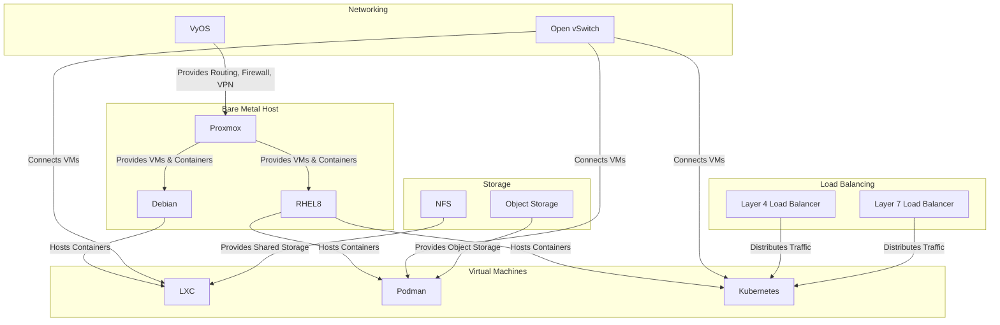

```mermaid
graph TD;
  subgraph "Bare Metal Host";
  A[Proxmox] -->|Provides VMs & Containers| B[Debian];
  A[Proxmox] -->|Provides VMs & Containers| C[RHEL8];
  end;
  subgraph "Virtual Machines";
  B[Debian] -->|Hosts Containers| D[LXC];
  C[RHEL8] -->|Hosts Containers| E[Podman];
  C[RHEL8] -->|Hosts Containers| F[Kubernetes];
  end;
  subgraph "Networking";
  G[Open vSwitch] -->|Connects VMs| D[LXC];
  G[Open vSwitch] -->|Connects VMs| E[Podman];
  G[Open vSwitch] -->|Connects VMs| F[Kubernetes];
  H[VyOS] -->|Provides Routing, Firewall, VPN| A[Proxmox];
  end;
  subgraph "Storage";
  I[NFS] -->|Provides Shared Storage| D[LXC];
  J[Object Storage] -->|Provides Object Storage| E[Podman];
  end;
  subgraph "Load Balancing";
  K[Layer 4 Load Balancer] -->|Distributes Traffic| F[Kubernetes];
  L[Layer 7 Load Balancer] -->|Distributes Traffic| F[Kubernetes];
  end;

```
